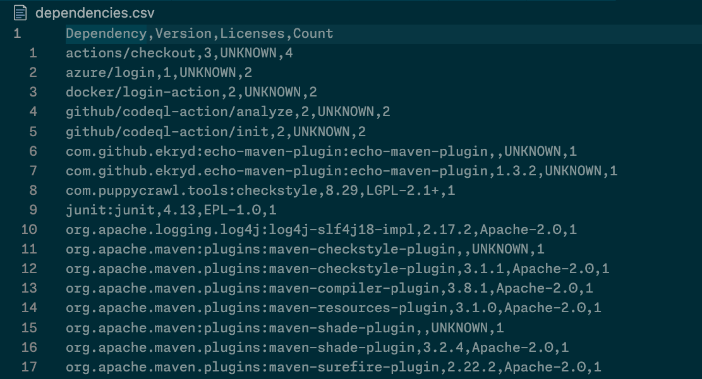

# GitHub Organization License Audit Tool

This tool is designed to audit the licenses of dependencies in a GitHub organization. It's written in Python and uses the `ghastoolkit` library to interact with GitHub's API.



## Getting Started

### ⚡️ Requirements

- [Python][python] `>= 3.10`
- [pip][python-pip] `>= 23.x`
  - `pip install ghastoolkit` (`>= 0.10.0`)
- [gh-cli][gh-cli] (optional)
- GitHub Personal Access Token (PAT)
  - scoped to the organization you want to audit
  - allowed access to **All repositories**
  - and the Repository Permissions `Metadata` and `Contents` set to `read-only`

### 📦 Installing

This is a gh CLI Extension. To install and setup the CLI tool, you can use the following commands:

```bash
# install extension
gh extension install davelosert/gh-org-license-audit

# install deps (ghastoolkit)
gh org-license-audit install

# run
gh org-license-audit --help
```

### Upgrade

```bash
gh extension upgrade org-license-audit
```

## Usage

The tool currently supports two commands which you can run serially

### Export Licenses

```shell
gh org-license-audit export-deps --org <org> --token <token> --target-csv <csv-file-path>

## The Token can also be provided as ENV Variable. The Target CSV is optional
GITHUB_TOKEN=<token> gh org-license-audit export-deps --org <org>
```

This command exports the licenses of all dependencies in a GitHub organization to a CSV file.

> [!IMPORTANT]
> On large organization, this command can take a few hours to run as it needs to fetch all the [SBOMs](https://docs.github.com/en/rest/dependency-graph/sboms?apiVersion=2022-11-28) from all the repositories in the organization while respecting the primary and secondary [GitHub API Rate Limits](https://docs.github.com/en/enterprise-cloud@latest/rest/using-the-rest-api/rate-limits-for-the-rest-api?apiVersion=2022-11-28) (which will automatically be handled for you)

You can run this command with the following options:

| Option       | Description                                                                         | Default Value    |
| ------------ | ----------------------------------------------------------------------------------- | ---------------- |
| --github-org | The name of the GitHub organization to audit.                                       | None             |
| --token      | Your GitHub API token. Can also be provided through the env variable `GITHUB_TOKEN` | None             |
| --target-csv | The path to the CSV file to write the licenses to.                                  | dependencies.csv |

> [!NOTE]
> This command might produce 404 Errors while it's running. This happens if a repository is found where the [Dependency Graph](https://docs.github.com/en/enterprise-cloud@latest/code-security/supply-chain-security/understanding-your-software-supply-chain/about-the-dependency-graph) is disabled. You can ignore these - but please be aware that for these repositories, no Dependency- and License Information can be collected.


### Aggregate Licenses

```shell
gh org-license-audit aggregate-licenses --source-csv <csv-file-path> --target-csv <csv-file-path>
```

This command aggregates all licenses previously found by the `export-deps` command and create a new CSV with all licenses and a count of the packages using them.

You can run this command with the following options:

| Option       | Description                                                      | Default Value    |
| ------------ | ---------------------------------------------------------------- | ---------------- |
| --source-csv | The path to the CSV file generated by the `export-deps` command. | dependencies.csv |
| --target-csv | The path to the CSV file to write the aggregated licenses to.    | licenses.csv     |

## 📄 License

This project is licensed under the MIT License - see the [LICENSE](./LICENSE) file for details.

[python]: https://www.python.org/
[python-pip]: https://pip.pypa.io/en/stable
[gh-cli]: https://cli.github.com/
